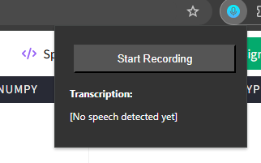
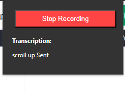

# WEB WHISPER (in progress)

A powerful Chrome extension designed to make web navigation hands-free and intuitive. With just your voice, you can open tabs, scroll through pages, click links, and even search the web—no need to lift a finger. Perfect for multitaskers, people with accessibility needs, or anyone looking for a more efficient and futuristic way to browse.

## Setup

Note: This extension uses the Chrome built in prompt API. Ensure that you have access to the API before going through the following steps. You can read more about the API and setting up [here](https://docs.google.com/document/d/1VG8HIyz361zGduWgNG7R_R8Xkv0OOJ8b5C9QKeCjU0c/edit?tab=t.0).

1. Clone this repository onto your device.
2. Go to your browser (where the built-in API is set up) and go to the [extensions page](chrome://extensions/).
3. Ensure Developer Mode is on.
4. Click on Load Unpacked Extension and choose the folder where this repository is closed.
5. Give the extension access to your microphone and you're good to go.
6. To use this extension, just click on the extension icon, and click 'Start recording'.

   

7. The extension will detect commands and send them to the backend to process.
8. To stop the recording, click on the Stop Recording button.

   

## Current Working

The extension uses the browser's inbilt speech recognition to recognise speech and generate commands.

We've created some DOM-based actions that can manipulate the browser.

For commands that follow a certain pattern, like scrolling, clicking and closing current tab, the extension tries to automatically choose the correct action. Failing that, the commands are sent to Prompt API, which decides on the best combination of actions to takes and sends an answer which is parsed and implemented.

Currently the only actions are scrolling, clicking, typing, opening a url in a new tab and closing the current tab.

## What's next

1. Adding more actions like:
   - go back
   - go forward
   - reload
   - switch to another tab
   - find in page
   - exit extension (stop recording)
   - stop the current action
   - search the web
   - select an element and perform further actions on it (get link, copy text etc)
   - control media playback
   - bookmark tab, open from bookmarked tabs
2. Add more ways to find an element, including xpath and css.
3. Provide feedback to user to confirm actions and give status of actions (e.g., "Page reloaded," "Link not found")
4. Add more ways to connect to AI (using user-given API keys) for users without access to the prompt API.
5. Allow users to chat directly with the AI if there is no command.
6. Provide interface for users to edit complex commands if they feel voice recognition is not accurate enough.
7. Add support for more languages.
8. Allow users to customise commands
